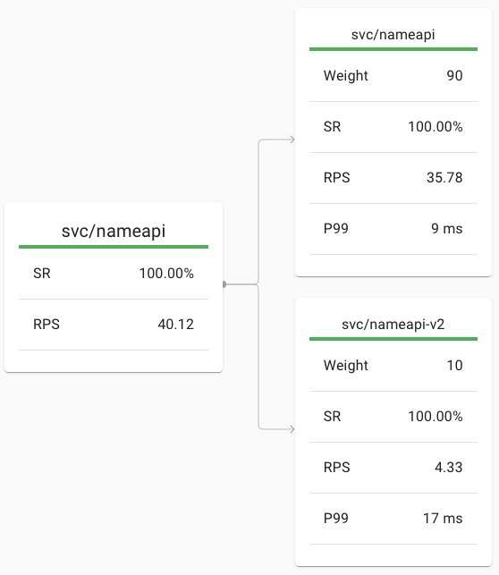
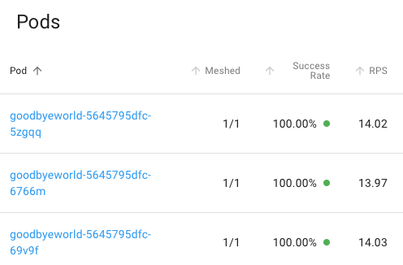

# HsH-FAVS-Prototype: Linkerd as a Service Mesh Solution

This project was developed within the context of the FAVS course ("Fortgeschrittene Aspekte verteilter Systeme") at Hannover University of Applied Sciences and Arts.

This Markdown is a short documentation on  
- how we setup our machine ([Set up the VPS](#set-up-the-vps)),  
- how we connect to it via `ssh` ([Connect to VPS](#connect-to-vps)),  
- how we use Linkerd on first sight and see its work ([Inspect Linkerd](#inspect-linkerd)) and  
- how we implemented showcases to prove Linkerd's work ([Implement Service Mesh Showcases](#implement-service-mesh-showcases)).

The corresponding elaboration you'll find in folder `tex`.

## Overview
- [Set up the VPS](#set-up-the-vps)
  - [Pre Steps](#pre-steps)
    - [Add a user different from `root`](#add-a-user-different-from-root)
    - [Change `ssh` Settings](#change-ssh-settings)
  - [Docker](#docker)
  - [Docker-Compose](#docker-compose)
  - [Post-installation Steps for Linux](#post-installation-steps-for-linux)
  - [Minikube](#minikube)
  - [`kubectl`](#kubectl)
  - [Firefox](#firefox)
  - [Linkerd](#linkerd)
  - [Bash-Completion](#bash-completion)
- [Connect to VPS](#connect-to-vps)
  - [`ssh` Hosts](#ssh-hosts)
  - [`ssh-copy-id`](#ssh-copy-id)
  - [Tunneling](#tunneling)
    - [Port-Forwarding](#port-forwarding)
      - [Use `LocalForward`](#use-localforward)
    - [X11 Forwarding](#x11-forwarding)
- [Get in touch with `linkerd` and `kubectl`](#get-in-touch-with-linkerd-and-kubectl)
  - [Use Linkerd](#use-linkerd)
  - [Install buggy demo app `emojivoto`](#install-buggy-demo-app-emojivoto)
  - [Building Docker Image for Minikube](#building-docker-image-for-minikube)
  - [Run K8s Job](#run-k8s-job)
- [Implement Service Mesh Showcases](#implement-service-mesh-showcases)
  - [Services](#services)
  - [Traefik as Ingress Controller](#traefik-as-ingress-controller)
  - [Deploy (unmeshed and meshed)](#deploy-unmeshed-and-meshed)
  - [Generate Load](#generate-load)
  - [Showcases](#showcases)
    - [Encryption](#encryption)
    - [Canary Deployment (90/10 Traffic Split)](#canary-deployment-9010-traffic-split)
    - [Load Balancing](#load-balancing)
    - [Logging](#logging)
- [Links](#links)

## Set up the VPS

What I have done so far from scratch on an Ubuntu 20.04...

### Pre Steps

Since our VPS is _online_ here's some security stuff...

#### Add a user different from `root`

...and password and add to Sudoers:
```
adduser <user-name>
usermod -aG sudo <user-name>
```

#### Change `ssh` Settings

Open
```
nano /etc/ssh/sshd_config
```
change Port
```
#Port 22 -> Port e.g. 57128
```

and disable `root` for ssh-login (since we have a sudo user already)
```
PermitRootLogin yes -> PermitRootLogin no
```

Apply with:
```
reboot
```

### Docker

Install Docker as it stated here: https://docs.docker.com/engine/install/ubuntu/
```
sudo apt-get update
sudo apt-get install -yq apt-transport-https ca-certificates curl gnupg-agent software-properties-common
curl -fsSL https://download.docker.com/linux/debian/gpg | sudo apt-key add -
sudo apt-key fingerprint 0EBFCD88
sudo add-apt-repository "deb [arch=amd64] https://download.docker.com/linux/ubuntu $(lsb_release -cs) stable"
sudo apt-get update
sudo apt-get install -yq docker-ce docker-ce-cli containerd.io
```
(Note the `-yq` options for `install` (assume yes and be quiet). It's pain trying to copy several lines of commands and `apt-get` aborts 'cause you didn't wrote "Y".)

### Docker-Compose

Now `docker-compose`: https://docs.docker.com/compose/install/
```
sudo curl -L "https://github.com/docker/compose/releases/download/1.27.4/docker-compose-$(uname -s)-$(uname -m)" -o /usr/local/bin/docker-compose
sudo chmod +x /usr/local/bin/docker-compose
sudo ln -s /usr/local/bin/docker-compose /usr/bin/docker-compose
```
(We do not need docker-compose for our Service Mesh, but for testing it's helpful.)

### Post-installation Steps for Linux

Add `docker` to Sudoers:
```
sudo groupadd docker#if not already exists
sudo usermod -aG docker $USER
newgrp docker 
```
(https://docs.docker.com/engine/install/linux-postinstall/)

### Minikube 

Minikube should be enough for us. 
It runs lightweight and should be easy to learn Kubernetes.
Also Linkerd recommends it ;)

```
curl -LO https://storage.googleapis.com/minikube/releases/latest/minikube-linux-amd64
sudo install minikube-linux-amd64 /usr/local/bin/minikube
rm minikube-linux-amd64
```
(https://minikube.sigs.k8s.io/docs/start/)

### `kubectl`

There is a `kubectl` within Minikube, but you'll always have to type several superfluous dashes what is _really_ annoying.
So lets just install it separate:
```
sudo snap install kubectl --classic
```

Check correct version (Linkerd needs 1.13 or above) with:
```
kubectl version --short
```

### Firefox

Needed for the X11 forwarding
```
sudo apt install firefox
```

### Linkerd

This part is accordingly to the official Tutorial: https://linkerd.io/2/getting-started/

Download and run install script for Linkerd-CLI
```
curl -sL https://run.linkerd.io/install | sh
```
and add to the `$PATH` environment:
```
export PATH=$PATH:$HOME/.linkerd2/bin
```
To make sure, this happens for every shell you run, put this into the `.bashrc`:
```
echo "export PATH=$PATH:$HOME/.linkerd2/bin" >> ~/.bashrc
```

Check if everything went well:
```
linkerd version
```
(Now this should return `Server version: unavailable` what's natch since Linkerd is not installed on the Kubernetes cluster yet.)

Validate cluster:
```
linkerd check --pre
```

Install Linkerd on cluster:
```
linkerd install | kubectl apply -f -
```

Validate installation:
```
linkerd check
```


### Bash-Completion

It is very useful to install bash-completion for the above installed programs.
Especially in `kubectl` you can compltete pod-names by pressing tab instead of typing huge pod-identifiers.

If bash-completion is not already installed:
```
apt-get install bash-completion
echo "source /etc/bash-completion" >> .bashrc 
```

To make completion available in every shell, we put each `source` command into the `.bashrc`.

**Linkerd**
```
echo "source <(linkerd completion bash)" >> .bashrc 
```
(For older bash or other OS check how to to with: `linkerd completion --help`)

**Minikube**
```
echo "source <(minikube completion bash)" >> .bashrc 
```
(For older bash or other OS check how to to with: `minikube completion --help`)

**kubectl**
```
echo "source <(kubectl completion bash)" >> .bashrc 
```
(For older bash or other OS check how to to with: `kubectl completion --help`)


## Connect to VPS

For login you need:
- IP of the VPS (you can easily ask for with `curl http://ipecho.net/plain`),
- Username and Password set in [Add a user different from `root`](#add-a-user-different-from-root),
- `ssh` port set in [Change `ssh` Settings](#change-ssh-settings)).

Connect via:
```
ssh -p <local-port> <user>@<ip-address>
```

### `ssh` Hosts
Easiest way here is to add a new `Host` in your local `ssh`-config.
```
nano ~/.ssh/config
```

And add (somewhere) these lines:
```
Host <config-name>
    Hostname <ip-address>
    Port <local-port>
    User <user>
```

Now you will only have to type: 
```
ssh <config-name>
```

### `ssh-copy-id`

To not always type your password for login, you can place your key remote for authentication.

If you already have a key-pair, copy your _public_ key with:
```
ssh-copy-id -i ~/.ssh/id_rsa.pub <config-name>
```
If not, check how to generate one here: https://www.ssh.com/ssh/copy-id


### Tunneling

The Result of the following methods is equivalent. 
Choose one Port- or X11-Forwarding.

#### Port-Forwarding

Forward one local port to the remote VPS.
```
ssh -L <local_port>:<destination_server_ip>:<remote_port> <ssh_server_hostname>
```

For us this is:
```
ssh -nNT -L 12345:127.0.0.1:38055 <config-name>
```
(The `-nNT` prevents the shell to be opened, since we only need the tunnel, not the remote shell.)

Ex. Run `linkerd dashboard &` on the VPS and you can access via:  
http://localhost:12345/

##### Use `LocalForward`
Optionally you can also configure the `ssh_config` for local forward:
```
Host <config-name>
    Hostname <ip-address>
    Port <local-port>
    User <user>
    LocalForward 12345 localhost:50750
```
When you use the shell (`ssh <config-name>`) it will automatically build up the local port-forwarding.
If you start a second remote shell, there will be an info, that port is already bind (here: `12345`). 
This is not a problem since the tunnel is already established.


One slower alternative (but sometimes not avoidable) is the X11 Forwarding.

#### X11 Forwarding

Run Firefox on the VPS and get the rendered image via X11.
```
ssh -C -Y <user>@<hostname>:<ssh-port> "firefox"
```

Ex. Run `minikube dashboard` on the VPS and you can access via:
```
ssh -C -Y <config-name> "firefox" "http://127.0.0.1:38055/api/v1/namespaces/kubernetes-dashboard/services/http:kubernetes-dashboard:/proxy/"
```
(Minikube changing its dashboard-port every time it starts :/)


## Get in touch with `linkerd` and `kubectl`

Running `docker ps` gives a strange result on first sight:
Just _one_ container named `minikube`.
_Within_ is where the fun begins.
Run `docker ps` to inspect the container-id of minikube.
Then jump into with:
```
docker exec -it <cotainer-id> /bin/bash
```
Here it is where `docker ps` gives the expected result:  
18 Kubernetes container and 
27 Linkerd container (yes, 45 summed up).

You can easily get there by using:
```
minikube ssh
```

### Use Linkerd

Run the Dashboard:
```
linkerd dashboard
```
Since we use it headless, this command will throw one warning (never mind).
The Dashboards are there.
- Linkerd: http://localhost:50750  
- Grafana: http://localhost:50750/grafana  
	Grafana visualizes metrics collected by Prometheus.

This is where we use the [`ssh`-tunnel](#port-forwarding) again.
```
ssh -nNT -L 12345:127.0.0.1:50750 <config-name>
```
And checkout locally:  
http://localhost:12345


### Install buggy demo app `emojivoto`

```
curl -sL https://run.linkerd.io/emojivoto.yml | kubectl apply -f -
```

And it's already running! Check with:
```
kubectl -n emojivoto port-forward svc/web-svc 8080:80
```
(and for sure again the `ssh`-tunnel)

Now add Linkerd to this:
```
kubectl get -n emojivoto deploy -o yaml \
  | linkerd inject - \
  | kubectl apply -f -
```
First get manifest, then Linkerd adds annotations (the sidecars).
Kubernetes will perform a rolling deploy.

To see whats currently happening in namespace `emojivoto`:
```
linkerd -n emojivoto top deploy
```

To remove the `emojivoto` pods, give Kubernetes the manifest again but now with `delete` instead of `apply`:
```
curl -sL https://run.linkerd.io/emojivoto.yml | kubectl delete -f -
```

### Building Docker Image for Minikube

Here's a good explanation from Sergei on Medium: 
[How to Run Locally Built Docker Images in Kubernetes](https://medium.com/swlh/how-to-run-locally-built-docker-images-in-kubernetes-b28fbc32cc1d)

To build a Docker Image so that Minikube can use it, we need to run following command in every shell, we want to build:
```
eval $(minikube -p minikube docker-env)
```
After this command, we can build from Dockerfile as usual:
```
docker build . -t <nice-tag>
```
Now Kubernetes can find tagged image stated in manifest.

### Run K8s Job 

This is a spartan `manifest.yml`:
```
apiVersion: batch/v1
kind: Job
metadata:
  name: <fancy-name>
spec:
  template:
    metadata:
      name: <fancy-pod-name>
    spec:
      containers:
      - name: <fancy-container-name>
        image: <image-tag-from-above>
        imagePullPolicy: Never
      restartPolicy: Never
```
Since this image is build locally, we add the `imagePullPolicy` to `Never`.

Now we can run it injecting Linkerd in one with:
```
cat <config-yml> \
  | linkerd inject - \
  | kubectl apply -f -
```

To list local pods:
```
kubectl get pods
```

Find unique name and check logs:
```
kubectl logs <unique-pod-name>
```
If there are several belonging containers, you'll have to specify:
```
kubectl logs <unique-pod-name> <fancy-container-name>
```

This will remove the pod again:
```
kubectl delete -f <config-yml>
```


## Implement Service Mesh Showcases

### Services
In `src/docker` you find all files to create services in Docker-Images.

To build them all in one and well-tagged you can use:
```
sh docker-build.sh
```
Remember to link your local environment to `minikube` as stated in [Building Docker Image for Minikube](#building-docker-image-for-minikube):
```
eval $(minikube -p minikube docker-env)
```

The images are used in Kubernetes' yamls in folder `src/svc`.
You may deploy them manually unmeshed with:
```
kubectl apply -f <path-to-yaml>
```
or meshed with:
```
cat <path-to-yaml> | linkerd inject - | kubectl apply -f -
```

To bring all together you find some shell-scripts in `src` for easy usage (see [Deploy (unmeshed and meshed)](#deploy-unmeshed-and-meshed)).


### Traefik as Ingress Controller
To install Traefik you have to use `helm` (a package manager for Kubernetes).

If `helm` is not installed yet:
```
sudo snap install helm --classic
```

Set up a namespace for Traefik:
```
kubectl create namespace traefik
```

Add Traefik repo to `helm` and install:
```
helm repo add traefik https://helm.traefik.io/traefik
helm repo update
helm install --set --namespace=traefik traefik traefik/traefik
```

In the services yamls in `src/svc` we added an ingress route for services that should be accessed from outside.
For example the ingress route of the `helloworld`-service looks like this:
```
apiVersion: extensions/v1beta1
kind: Ingress
metadata:
  name: helloworld
  annotations:
    kubernetes.io/ingress.class: "traefik"
    ingress.kubernetes.io/custom-request-headers: l5d-dst-override:helloworld.default.svc.cluster.local:80
spec:
  rules:
  - http:
      paths:
      - path: /helloworld
        backend:
          serviceName: helloworld
          servicePort: 80
```
First we tell Kuberenetes to use Traefik as ingress controller. 
Second we route all traffic to the corresponding Linkerd-sidecar (abbreviated here in Kubernetes-style with `l5d`). 
This configuration allows us to use different routes for different services by calling another path in the URL. 
Analog route we defined for `goodbyeworld`-service.


### Deploy (unmeshed and meshed)

At first we deploy services unmeshed without Linkerd-injection.
```
sh deploy-unmeshed.sh
```
This script only applies services in Kubernetes.

When starting the Linkerd Dashboard with
```
linkerd dashboard
```
We can see unmeshed services in the UI.

To apply them injected by Linkerd use:
```
sh deploy-meshed.sh
```
This script applies services in Kubernetes *injected* by Linkerd.

In the UI now we see all service with status *meshed**.


### Generate Load

To see some monitoring power of Linkerd we need load.
The scripts beginning with `load-` easily use `curl` on the services within a `for`-loop:
```
sh load-...sh
```


### Showcases
Our prototypical implementation aims to provide answers to the following four challenges of running and maintaining microservices.

1. Encryption: 
	By using a service mesh, it should be shown that an encryption policy can be easily applied or removed.
2. Canary Deployment: 
	To provide an example showcase for canary deployment, we implemented two versions of `nameapi` which differ by the returned string (version 1 returns only forename while version 2 returns surname as well). 
	The mesh is tasked with redirecting traffic so that 90% of all requests are made to version 1 and 10% of requests are made to version 2.
3. Load Balancing: 
	Some service meshes also provide load balancing techniques, including a dashboard which visualizes the distribution of the specific load. 
	This is also a showcase of our proof of concept.
4. Central Monitoring and Logging: 
	The proof of concept should show that services in a microservice landscape can be monitored and managed centrally using the service mesh.

In the following we state how we proved them...

#### Encryption
To use encryped connections between the services we have nothing to do (if services are meshed).
You can easily check by giving some load on eg. the `helloworld`-service and run the following command:
```
linkerd tap deploy/helloworld
```

Here you can see the realtime network tap on this service.
For each connection you'll find the info `TLS=true`.

By default Linkerd rolls out new certificates periodically and ensures encryption out-of-box.

#### Canary Deployment (90/10 Traffic Split)
To show this case, we implemented a new version of `nameapi`-service.
Here we return next to forename also surname.
To deploy `nameapi2.yaml` and `trafficsplit-90-10.yaml` you can easily use:
```
sh deploy-nameapi-v2.sh
```

This will apply a second version of `nameapi`-service next to existing one.
And also add the 90/10 traffic split.

The Linkerd dashboard now shows a new section for this traffic split.
If you now run `load-single-helloworld.sh`, Linkerd will show that 90% of request will go to the old and 10% to the new version.




#### Load Balancing
The `goodbye`-deployment we configured with three pods (see `svc/goodbyeworld.yaml`):
```
spec:
  replicas: 3
```

By running `load-goodbyeworld.sh` you'll see the load-balancing in the `goodbyeworld`-deployment section in Linkerd as follows.



The request per second (RPS) are evenly balanced on each replica of `goodbyeworld`-service.


#### Logging
There is no way to see the logs from all services on one site.
With the dashboard you can identify problems the container throwing errors.
After that you can show the logs from this container with (as stated in [Run K8s Job](#run-k8s-job)):

```
kubectl logs <unique-pod-name> <fancy-container-name>
```
For example get all logs from `helloworld`-service:
```
kubectl logs helloworld-86bffbb9bf-6m7c5 helloworld 
```
(This command won't work for you since Kubernetes generates a different unique identifier for each `apply`.)

Especially for this command the `bash-completion`is very useful (see [Bash-Completion](#bash-completion)).
As you can see in the example, Kubernetes deploys pods with an unique name by appending an alphanumeric identifier to the service-name. 
To get info about these pods you’d have to type the whole pod-name accurate. 
With `bash-completion` you can complete the 15-digits unique identifier automatically by pressing the tab-key.


## Links

- Getting Started with Linkerd:  
	https://linkerd.io/2/getting-started/
- Getting Started with Minikube:  
	https://minikube.sigs.k8s.io/docs/start/
- Install Docker:  
	https://docs.docker.com/engine/install/ubuntu/
- Install `docker-compose`:  
	https://docs.docker.com/compose/install/
- Traefik Proxy:  
	https://helm.traefik.io/traefik resp. https://traefik.io/traefik
- Locally Building Docker Image for Minikube from Sergei on Medium:  
	https://medium.com/swlh/how-to-run-locally-built-docker-images-in-kubernetes-b28fbc32cc1d
- IPecho:  
	http://ipecho.net/plain resp. http://ipecho.net
- Tutorial `ssh-copy-id`:  
	https://www.ssh.com/ssh/copy-id


